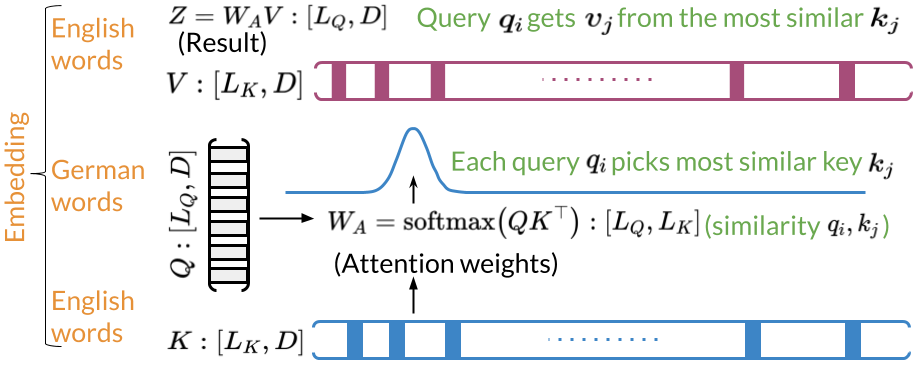

# Text Summarization
# The Three Ways of Attention and Dot Product Attention: Ungraded Lab Notebook

In this notebook you'll explore the three ways of attention (encoder-decoder attention, causal attention, and bi-directional self attention) and how to implement the latter two with dot product attention. 

## Background

As you learned last week, **attention models** constitute powerful tools in the NLP practitioner's toolkit. Like LSTMs, they learn which words are most important to phrases, sentences, paragraphs, and so on. Moreover, they mitigate the vanishing gradient problem even better than LSTMs. You've already seen how to combine attention with LSTMs to build **encoder-decoder models** for applications such as machine translation. 

This week, you'll see how to integrate attention into **transformers**. Because transformers are not sequence models, they are much easier to parallelize and accelerate. Beyond machine translation, applications of transformers include: 
* Auto-completion
* Named Entity Recognition
* Chatbots
* Question-Answering
* And more!

Along with embedding, positional encoding, dense layers, and residual connections, attention is a crucial component of transformers. At the heart of any attention scheme used in a transformer is **dot product attention**, of which the figures below display a simplified picture:

With basic dot product attention, you capture the interactions between every word (embedding) in your query and every word in your key. If the queries and keys belong to the same sentences, this constitutes **bi-directional self-attention**. In some situations, however, it's more appropriate to consider only words which have come before the current one. Such cases, particularly when the queries and keys come from the same sentences, fall into the category of **causal attention**. 

For causal attention, we add a **mask** to the argument of our softmax function, as illustrated below: 

Now let's see how to implement attention with NumPy. When you integrate attention into a transformer network defined with Trax, you'll have to use `trax.fastmath.numpy` instead, since Trax's arrays are based on JAX DeviceArrays. Fortunately, the function interfaces are often identical.
